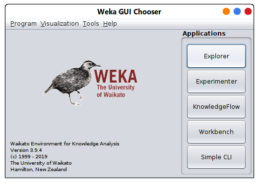

# Introduction sur Weka 

Weka est un atelier d'exploration de données ou un environnement Waikato pour l'analyse des connaissances.

Il contient des algorithmes d'apprentissage automatique pour les tâches d'exploration de données

      • 100+ algorithmes de classification
      • 75 pour le prétraitement des données
      • 25 pour aider à la sélection des fonctionnalités
      • 20 pour le clustering, la recherche de règles d'association, etc.

## Site officiel

Pour télécharger Weka et obtenir de la documentation, consultez [ce lien](https://www.cs.waikato.ac.nz/ml/weka/)

