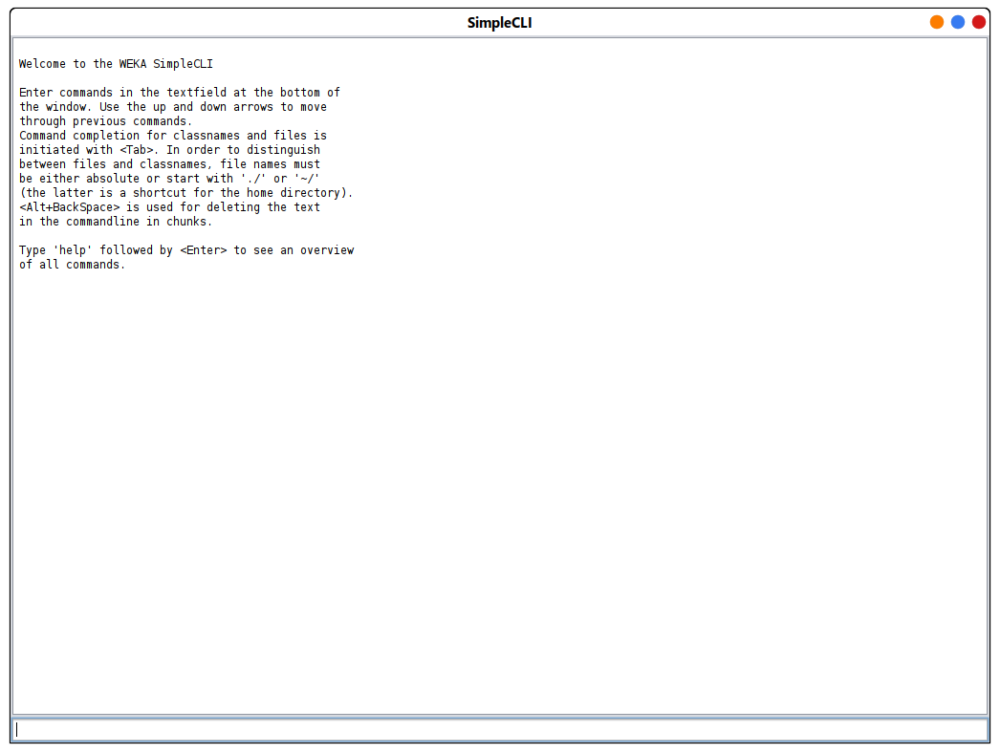
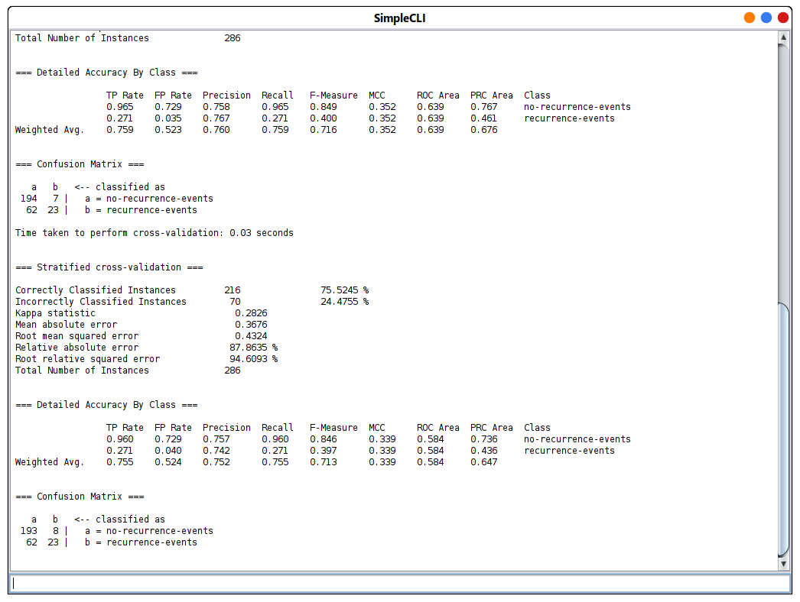

# Simple Cli

L'utilisation de la ligne de commande dans wike est simple
ouvrez simplement l'interface de ligne de commande et tapez `java` <la classe d'algorithme> et le `-t` suivi du chemin complet vers le fichier du dataset.

<div style='width:80%; margin: auto'>



</div>

<div style='width:80%; margin: auto'>



</div>

## example: 

the command :

```bash
java weka.classifiers.trees.J48 -t /home/moh//datasets/breast-cancer.arff
```

the result: 

```bash
> java weka.classifiers.trees.J48 -t /home/moh/datasets/breast-cancer.arff


=== Classifier model (full training set) ===

J48 pruned tree
------------------

node-caps = yes
|   deg-malig = 1: recurrence-events (1.01/0.4)
|   deg-malig = 2: no-recurrence-events (26.2/8.0)
|   deg-malig = 3: recurrence-events (30.4/7.4)
node-caps = no: no-recurrence-events (228.39/53.4)

Number of Leaves  : 	4

Size of the tree : 	6


Time taken to build model: 0.01 seconds

Time taken to test model on training data: 0.01 seconds

=== Error on training data ===

Correctly Classified Instances         217               75.8741 %
Incorrectly Classified Instances        69               24.1259 %
Kappa statistic                          0.2899
Mean absolute error                      0.3658
Root mean squared error                  0.4269
Relative absolute error                 87.4491 %
Root relative squared error             93.4017 %
Total Number of Instances              286     


=== Detailed Accuracy By Class ===

                 TP Rate  FP Rate  Precision  Recall   F-Measure  MCC      ROC Area  PRC Area  Class
                 0.965    0.729    0.758      0.965    0.849      0.352    0.639     0.767     no-recurrence-events
                 0.271    0.035    0.767      0.271    0.400      0.352    0.639     0.461     recurrence-events
Weighted Avg.    0.759    0.523    0.760      0.759    0.716      0.352    0.639     0.676     


=== Confusion Matrix ===

   a   b   <-- classified as
 194   7 |   a = no-recurrence-events
  62  23 |   b = recurrence-events

Time taken to perform cross-validation: 0.03 seconds


=== Stratified cross-validation ===

Correctly Classified Instances         216               75.5245 %
Incorrectly Classified Instances        70               24.4755 %
Kappa statistic                          0.2826
Mean absolute error                      0.3676
Root mean squared error                  0.4324
Relative absolute error                 87.8635 %
Root relative squared error             94.6093 %
Total Number of Instances              286     


=== Detailed Accuracy By Class ===

                 TP Rate  FP Rate  Precision  Recall   F-Measure  MCC      ROC Area  PRC Area  Class
                 0.960    0.729    0.757      0.960    0.846      0.339    0.584     0.736     no-recurrence-events
                 0.271    0.040    0.742      0.271    0.397      0.339    0.584     0.436     recurrence-events
Weighted Avg.    0.755    0.524    0.752      0.755    0.713      0.339    0.584     0.647     


=== Confusion Matrix ===

   a   b   <-- classified as
 193   8 |   a = no-recurrence-events
  62  23 |   b = recurrence-events
```