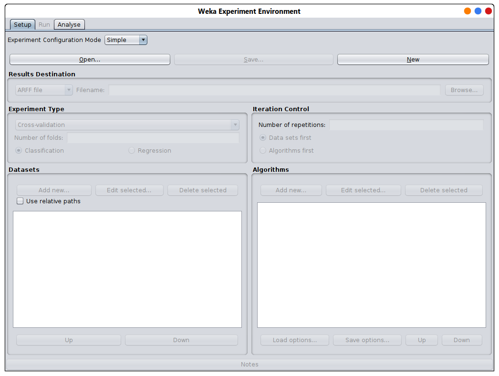
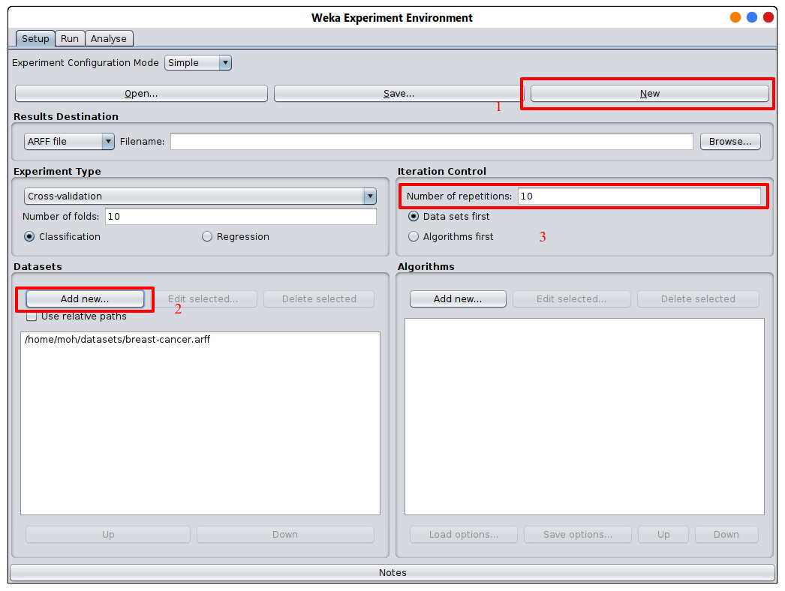
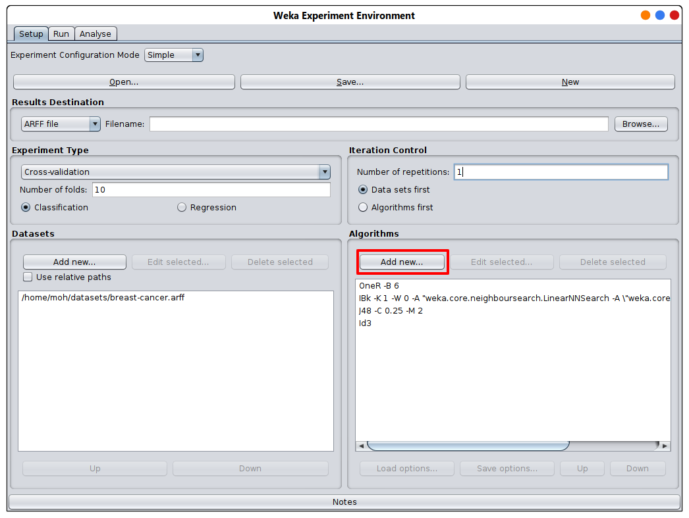
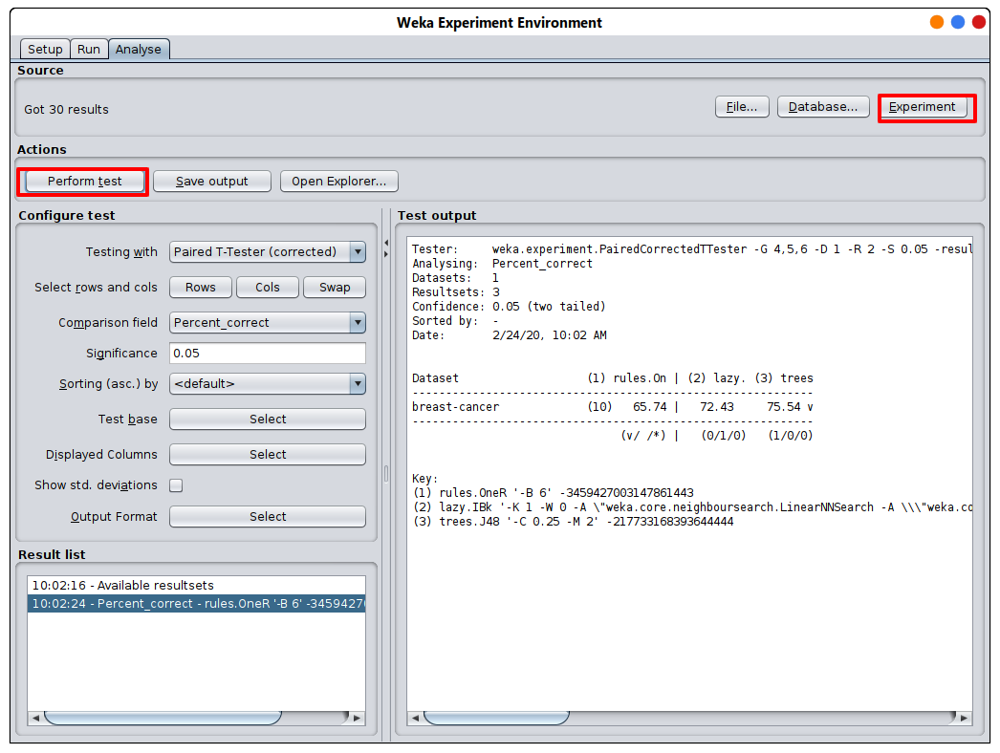

# Experimenter

L'utilisation de l'interface Experimenter permet de savoire : 

- détermination des performances moyenne et écart type d'un algorithme de classification sur un jeu de données ... ou de plusieurs algorithmes sur plusieurs jeux de données
- Un classificateur est-il meilleur qu'un autre sur un ensemble de données particulier? ... et la différence est-elle statistiquement significative?
- Un réglage de paramètre pour un algorithme est-il meilleur qu'un autre?
- Le résultat de ces tests peut être exprimé sous forme de fichier ARFF
- Le calcul peut prendre des jours ou des semaines ... et peut être distribué sur plusieurs ordinateurs

## Utiliser l'expérimentateur
 1. cliquez sur nouveau et ajoutez un ou plusieurs jeux de données et le nombre de répétitions
 
 

 
 
 
 

 
 2. sélectionnez les algorithmes
 
 

  
  
  
 

  
 3. allez dans l'onglet run et cliquez sur start
 
 

    
  

 
 
 
 4. allez dans l'onglet analyse, cliquez sur expérimenter et cliquez sur perform test
 
 

     
   
 
 

 
 ## le résultat
 

Tester:     weka.experiment.PairedCorrectedTTester -G 4,5,6 -D 1 -R 2 -S 0.05 -result-matrix "weka.experiment.ResultMatrixPlainText -mean-prec 2 -stddev-prec 2 -col-name-width 0 -row-name-width 25 -mean-width 0 -stddev-width 0 -sig-width 0 -count-width 5 -print-col-names -print-row-names -enum-col-names"

Analysing:  Percent_correct

Datasets:   1

Resultsets: 3

Confidence: 0.05 (two tailed)

Sorted by:  -

Date:       2/24/20, 10:02 AM

| Dataset                  | (1) rules.On | (2) lazy. | (3) trees |
| -------------------------|--------------|-----------|-----------|
| breast-cancer            | (10)   65.74 |     72.43 |   75.54 v |
|                          |      (v/ /*) |   (0/1/0) |   (1/0/0) |

Key:

    - rules.OneR '-B 6' -3459427003147861443
    - lazy.IBk '-K 1 -W 0 -A \"weka.core.neighboursearch.LinearNNSearch -A \\\"weka.core.EuclideanDistance -R first-last\\\"\"' -3080186098777067172
    - trees.J48 '-C 0.25 -M 2' -217733168393644444

## interprétation

en analysant en utilisant Percent_correct avec la méthode de cross-validation, 
nous pouvons voir que le J48 est le meilleur algorithme pour cet ensemble de données