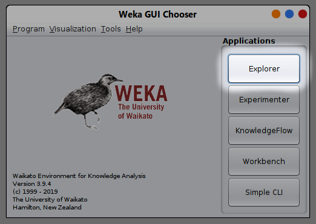
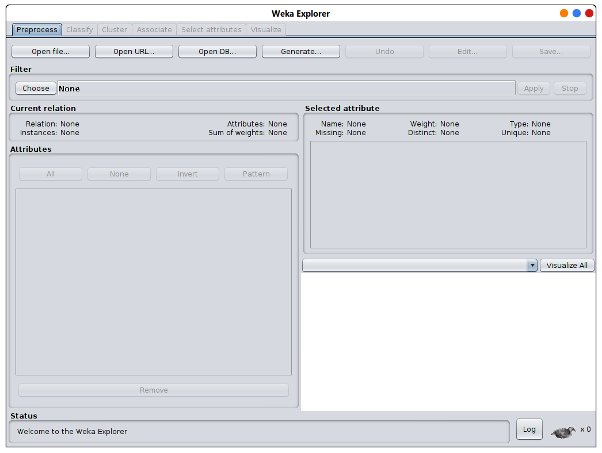
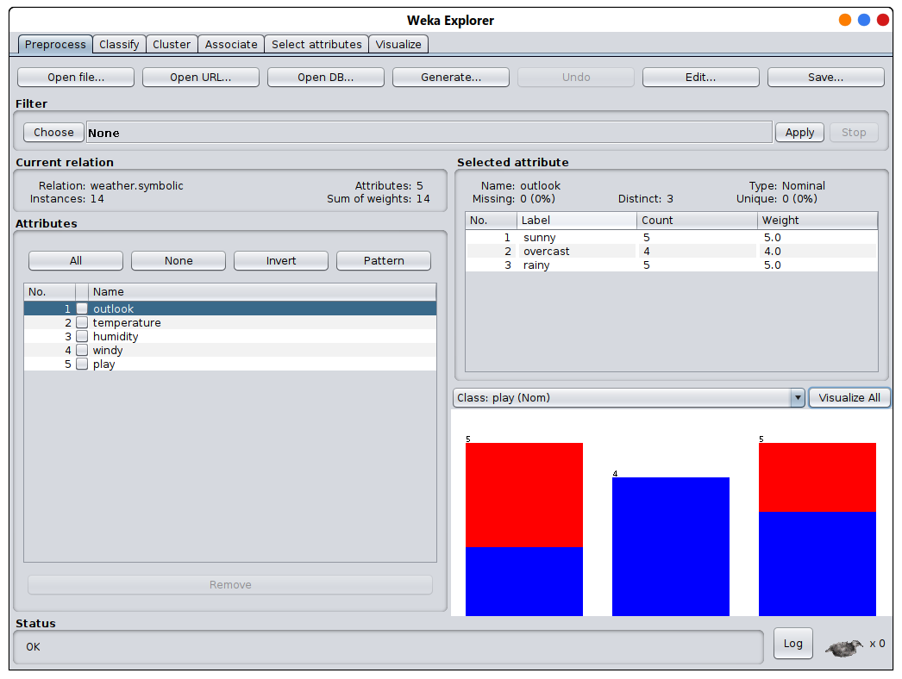
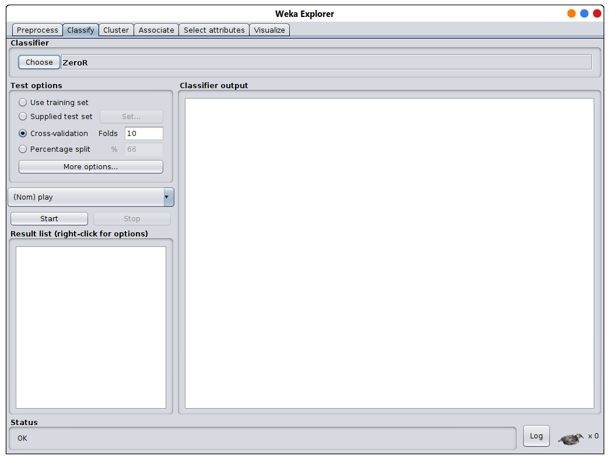
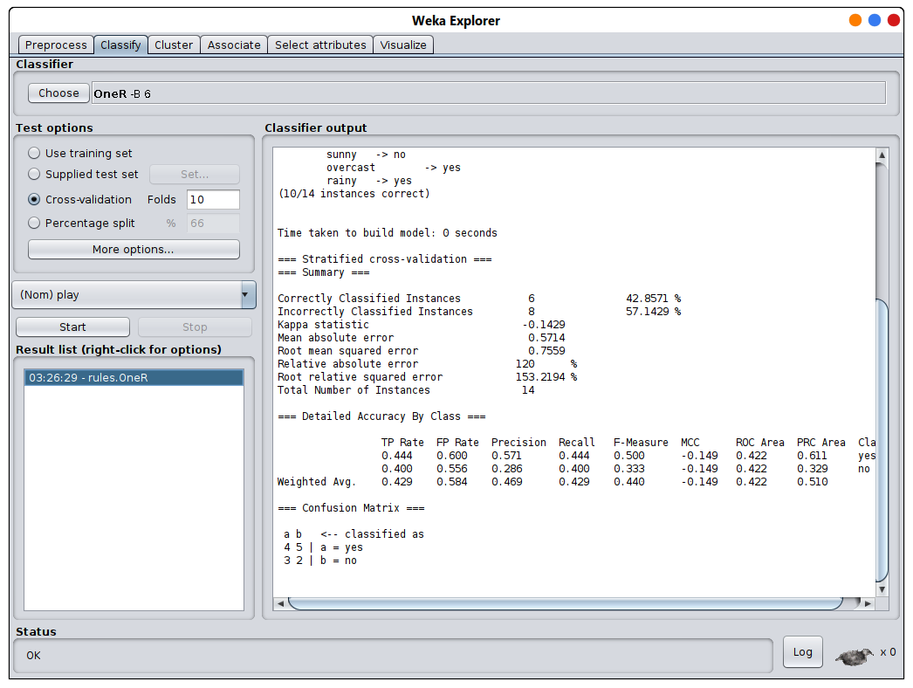

# Explorateur

En cliquant sur le premier bouton à droite du sélecteur GUI, vous ouvrirez l'explorateur

## Brève explication

Dans cette fenêtre, nous avons quelques onglets:

### Prétraitement (preprocessing):
Ici, nous pouvons choisir une dataset, voir l'ensemble de données, 
modifier l'ensemble de données, le prévisualiser et effectuer un prétraitement

### Classer (Classify):
Dans cet onglet, nous traitons l'ensemble de données à l'aide de différents algorithmes, 
et nous pouvons modifier les paramètres des algorithmes et voir le résultat

### Les autres onglets:
Les autres onglets concernent le clustering, l'association, la sélection d'attributs et la visualisation

## Ouverture d'une dataset

En cliquant sur le bouton `Open file` on peut choisir une dataset, ils sont dans le répertoire
 Weka dans un dossier appelé **data**
 
> j'ai choisi le fichier i have choose the file `weather.nominal.arff`

Dans ce fichier, on a 5 attributs comme indiqué en bas à gauche. 
Sur la droite, on peut voir les détails de l'attribut sélectionné (étiquette, nombre, poids), 
on peut choisir la classe et on a un graphe pour les détails de l'attribut

En haut, on peut voir le dataset ou le modifier et l'enregistrer, 
et on peut aussi choisir un filtre (ou des filtres)

## Traitement de dataset

Dans le deuxième onglet, on peut choisir un algorithme à utiliser sur l'ensemble de données qui a été choisi, on clique sur le bouton choisir puis on sélectionne un algorithme (je vais juste sélectionner OneR)

Puis on clique sur le bouton de démarrage pour démarrer l'algorithme

Le résultat apparaîtra à droite
