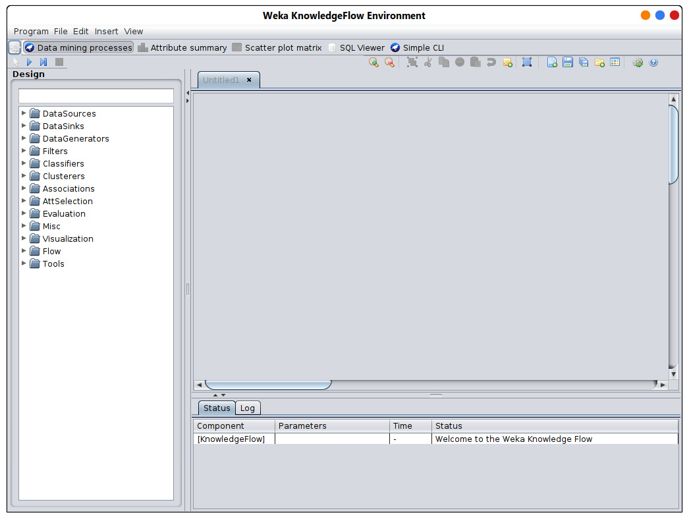
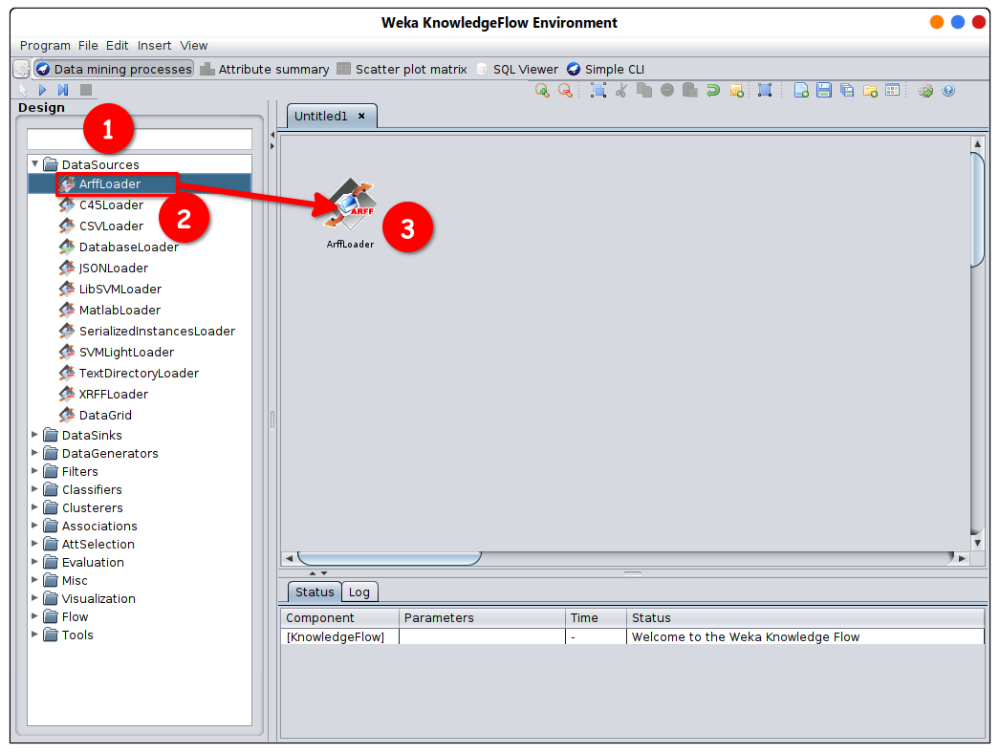
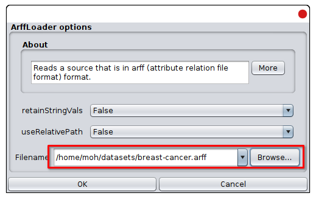
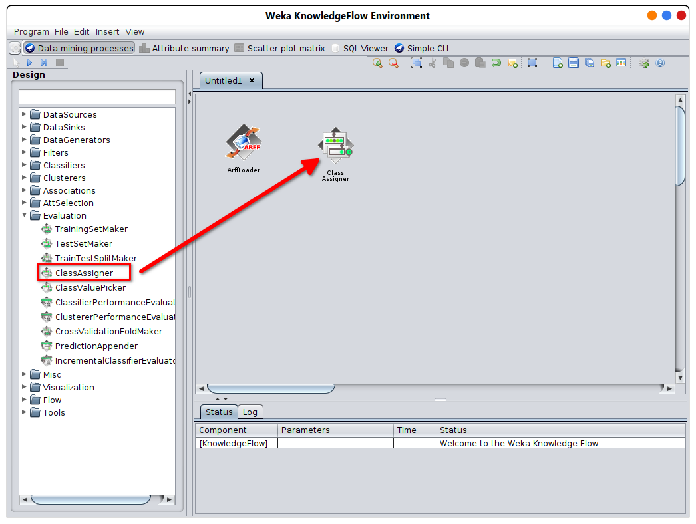
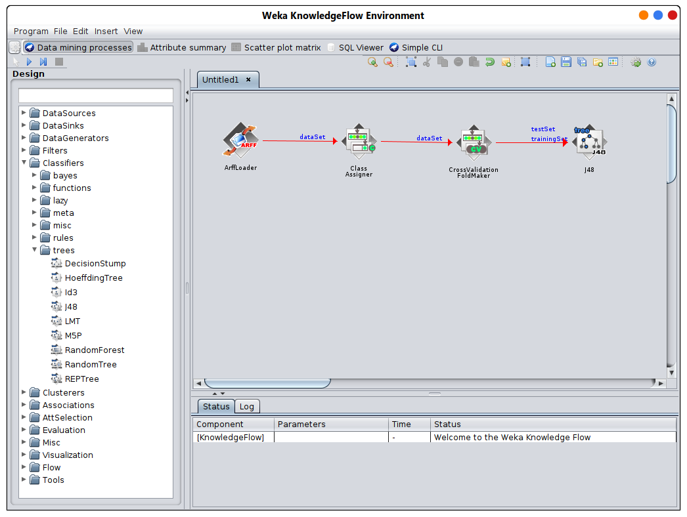
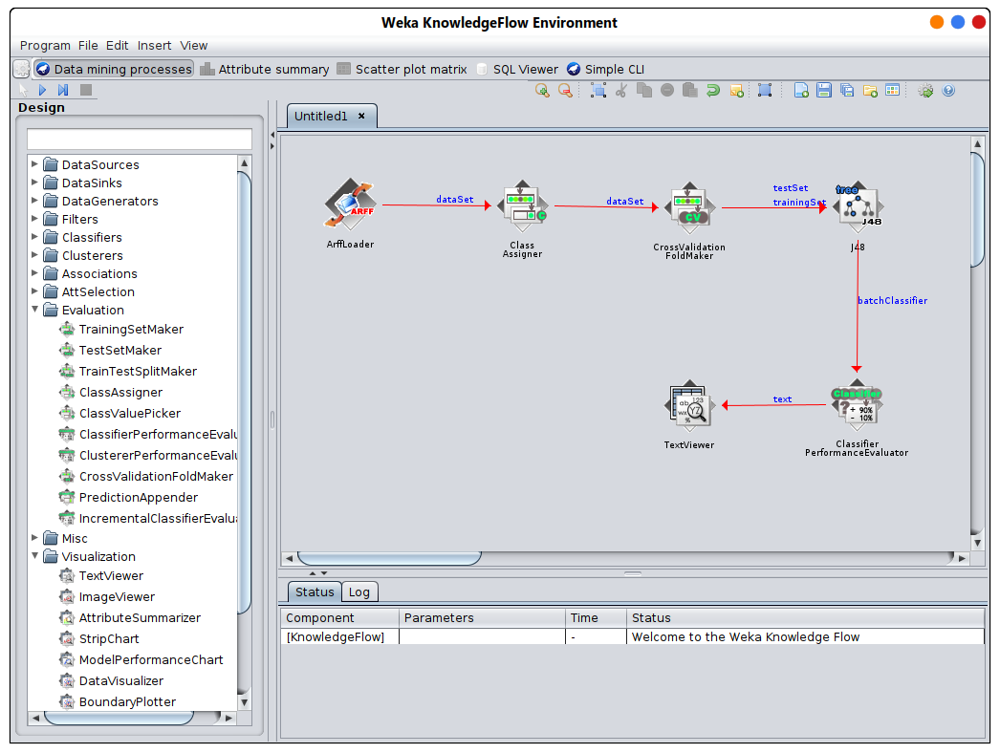
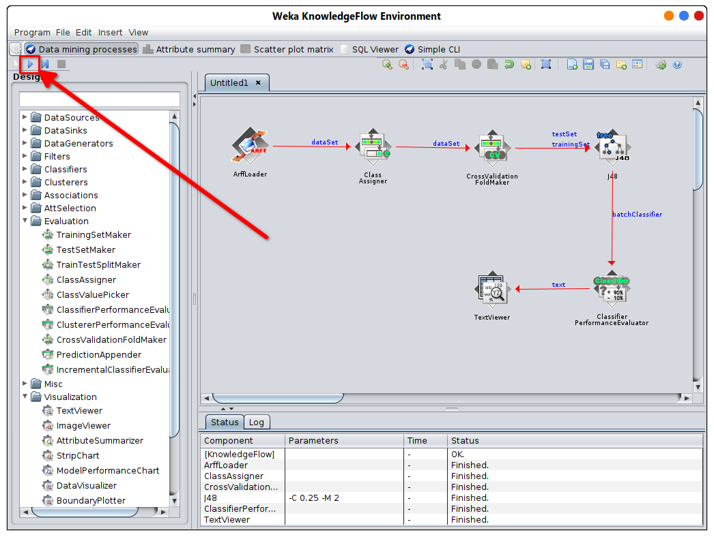
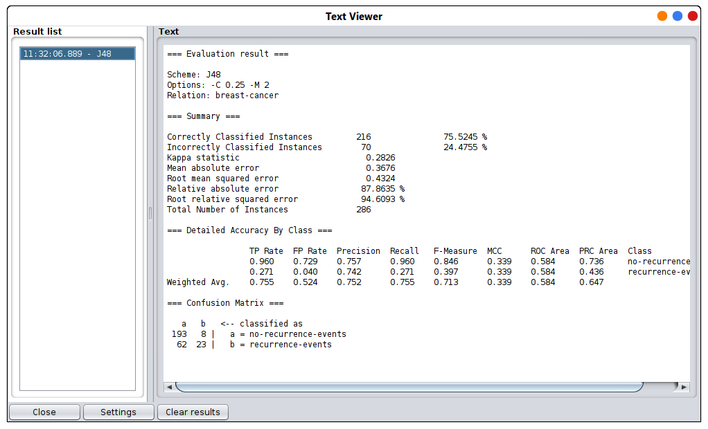

# Knowledge Flow
 
L'interface du Knowledge Flow est une alternative à l'Explorer

 - Disposition interactive des filtres, classificateurs, évaluateurs sur un canevas 2D
 - Les composants incluent les sources de données, les récepteurs de données, l'évaluation, la visualisation
 - Différents types de connexions entre les composants
   - Instance ou dataset
   - test set, training set
   - classifier
   - sortie, texte ou graphique
 - Peut fonctionner de manière incrémentielle, sur des data streams potentiellement infinis
 - Peut regarder à l'intérieur de la validation croisée des modèles individuels produits

## Utiliser l'interface de Knowledge Flow

 1 cliquez sur le dataSource et choisissez arffLoader et placez-le dans le canevas
 

 
 
 
 

 
 2 faites un clic droit sur l'arffLoader et choisissez configurer puis chargez un fichier et cliquez sur ok
 

 
 
 
 

 3 ajoutez un classAssigner à partir du dossier Evaluation
 

 
 
 
 

 4 ajoutez un lien de dataset de l'arffLoader au ClassAssigner puis ajoutez un crossValidationFoldMaker
   et le lier aussi avec le lien de dataset et ajouter un classificateur (J48 dans cet exemple)
 

 
 
 
 

 
 5 ajoutez classifierPerformanceTest et liez-le au classificateur avec batchClassifier 
 lien (clic droit sur le classificateur)
 
 6 ajoutez un textViewer à partir du dossier de visualisation et liez-y le classifierPerformanceTest avec un lien texte
 
 

  
  
  
 

 
 7. appuyez sur le bouton démarrer en haut
 

 
  
  
  
  

 
 8. faites un clic droit sur le TextViewer et choisissez show results
 
 

 
  
  
  
  
